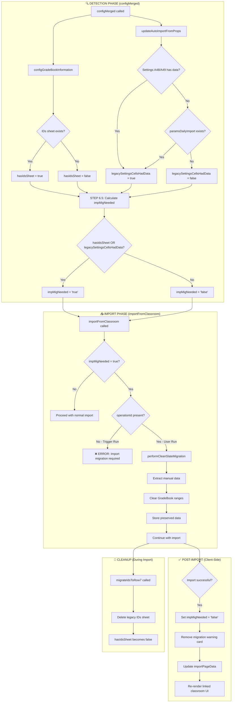

# Import Migration Check

## Overview
This document outlines the verification process for ensuring the import migration system is functioning correctly. The primary goal is to confirm that migration flags are properly set and checked, preventing persistent errors during manual imports.

## Migration Locations
There are two distinct migration processes in the codebase:

### 1. Settings Migration (Config Merged)
- **Purpose**: Migrates legacy import settings to the new format.
- **Location**: Handled within the config merged logic.
- **Focus**: Only affects import configuration, not the Gradebook structure itself.

### 2. Gradebook Structure Migration
- **Purpose**: Detects and handles migration of the Gradebook from legacy format to new format.
- **Examples**:
  - No longer using IDs sheet.
  - Moving to row 7 for data placement.
- **Note**: This is unrelated to settings migration; it pertains to the Gradebook's internal structure.

## Verification Steps
To ensure all migration flags are properly set and checked:

1. **Identify Migration Flags**: Locate all flags used for both types of migration.
2. **Check Setting Logic**: Verify that flags are set correctly after successful migration.
3. **Check Checking Logic**: Ensure flags are checked appropriately before proceeding with import operations.
4. **Test Both Pathways**: Confirm behavior for Gradebooks that have and have not been migrated.

## Code Flow
Provide a brief step-by-step code flow detailing what is checked and each possible pathway:

1. **Initiate Import**: User triggers manual import.
2. **Check Migration Flag**:
   - If migration flag indicates pending migration, throw error: "Import migration required. Please run a manual import from within the GradeBook."
   - Error originates from `import/start/start.js` line 48.
3. **Proceed if Migrated**: If flag shows migration is complete, continue with import process.
4. **Post-Import Update**: After successful import, ensure migration flag is updated if applicable.

## Common Error Handling
- **Error Message**: "Import migration required. Please run a manual import from within the GradeBook."
- **Source**: `importFromClassroom` function in `import/start/start.js` at line 48.
- **Context**: Appears during automated triggers but originates from import logic, not trigger pathways.
- **Concern**: If manual import fails to set the migration flag properly, users may encounter this error repeatedly.

### Sample Error Log
```
[ERROR], 2025-Dec-22 8:31:39 PM, User Email: xxx, GradeBookId: xxxx, Function: importFromClassroom-trigger, GradeBook Version: v6.25, GradeBook Dev Version: v6.251, Error: Import migration required. Please run a manual import from within the GradeBook., Stack Trace: Error: Import migration required. Please run a manual import from within the GradeBook.
    at importFromClassroom (import/start/start:48:33)
    at processImportsPass (automation/triggerRun:553:32)
    at gbRunHourlyAutoFeatures (automation/triggerRun:181:35)
```

## Next Steps
- Investigate why the migration flag might not be set during manual imports.
- Ensure both migration locations (settings and structure) are covered in flag checks.
- Test scenarios where Gradebook migration is required versus already completed.

---

## Answers to Verification Steps

### 1. Identify Migration Flags

| Flag | Location | Purpose |
|------|----------|---------|
| `impMigNeeded` | `config.local.settAutoImp.impMigNeeded` | Master flag indicating migration is required. Calculated dynamically in `configMerged()`. |
| `legacySettingsCellsHadData` | `config.local.settAutoImp.legacySettingsCellsHadData` | Set to `"true"` when legacy data found in Settings sheet A48/A49/B49 or `paramsDailyImport` doc property. |
| `hasIdsSheet` | `config.local.gradeBookInfo.hasIdsSheet` | Set to `"true"` if the spreadsheet contains a legacy "IDs" sheet. |

### 2. Check Setting Logic (When Flags Are Set)

#### `legacySettingsCellsHadData` - Set in `config/utilities.js` (lines 482-560)
```javascript
// Lines 482-560: updateAutoImportFromProps()
// Set to "true" when:
// 1. Settings sheet A48/A49/B49 contain legacy Classroom course data
// 2. OR document property "paramsDailyImport" exists with courseId
legacySettingsCellsHadData = "true";  // Line 509, 532
```

#### `hasIdsSheet` - Set in `config/configGradeBookInformation.js` (line 70)
```javascript
// Line 70: Detected during GradeBook validation
const hasIdsSheet = sheetNames.includes("IDs") ? "true" : "false";
```

#### `impMigNeeded` - Calculated in `config/configMerged.js` (lines 188-214)
```javascript
// Lines 188-214: STEP 6.5 - CALCULATE MIGRATION STATUS
const hasLegacySettingsCells = stringToBoolean(autoImp.legacySettingsCellsHadData);
const hasIdsSheet = stringToBoolean(gbi.hasIdsSheet);
const legacyEvidence = hasLegacySettingsCells || hasIdsSheet;
const migrationNeeded = legacyEvidence;
result.local.settAutoImp.impMigNeeded = migrationNeeded ? "true" : "false";
```

### 3. Check Checking Logic (When Flags Are Evaluated)

#### Server-Side Check in `import/start/start.js` (lines 39-78)
```javascript
// Lines 39-78: importFromClassroom()
const migrationNeeded = stringToBoolean(configData.local?.settAutoImp?.impMigNeeded);

if (migrationNeeded) {
    // Only allow migration during user-run (operationId present)
    if (!operationId) {
        // TRIGGER RUN - Block with error
        return createUnifiedResponse({
            status: 'error',
            message: 'Import migration required. Please run a manual import...',
            // ...
        });
    }
    // USER RUN - Perform migration
    const migrationResult = performCleanSlateMigration(configData);
    // ...
}
```

#### Client-Side Check in `import/client/importScript.html` (lines 1215-1280)
```javascript
// Lines 1215-1280: Check and display migration warning
const migrationNeeded = stringToBoolean(config?.local?.settAutoImp?.impMigNeeded);
if (migrationNeeded) {
    showMigrationWarning();  // Displays warning card to user
}
```

#### Page Load Check in `import/load/pageLoadUtilities.js` (line 17)
```javascript
// Line 17: getImportPageData()
const isCleanSlateMigrationNeeded = stringToBoolean(autoImportSection.impMigNeeded);
```

### 4. Test Both Pathways

| Scenario | `hasIdsSheet` | `legacySettingsCellsHadData` | `impMigNeeded` | Behavior |
|----------|---------------|------------------------------|----------------|----------|
| Fresh GradeBook | `false` | `false` | `false` | Normal import proceeds |
| Legacy with IDs sheet | `true` | `false` | `true` | Requires manual import for migration |
| Legacy with Settings cells | `false` | `true` | `true` | Requires manual import for migration |
| Both legacy indicators | `true` | `true` | `true` | Requires manual import for migration |
| After successful manual import | `false`* | `false`** | `false` | Normal import proceeds |

\* IDs sheet is deleted during migration by `migrateIdsToRow7()` in `import/core_refactored/helpers_rowSeven.js`.  
\** Legacy cells are cleared during config loading in `updateAutoImportFromProps()`.

---

## Complete Code Flow



### Step-by-Step Detailed Flow

#### 1. **Config Loading (configMerged.js)**
```
User opens Import sidebar
    └── configMerged() called
        ├── configGradeBookInformation(ss)
        │   └── Line 70: hasIdsSheet = sheetNames.includes("IDs")
        │
        ├── updateAutoImportFromProps(localConfig, allDocProps)
        │   ├── Line 498-509: Check Settings A48/A49/B49 for legacy data
        │   ├── Line 523-532: Check paramsDailyImport doc property
        │   └── Set legacySettingsCellsHadData = "true" if found
        │
        └── STEP 6.5 (Lines 188-214): Calculate impMigNeeded
            └── impMigNeeded = hasIdsSheet || legacySettingsCellsHadData
```

#### 2. **User Clicks "Update Grades from Classroom"**
```
startImportProcess() called (importScript.html line 536)
    ├── isCleanSlateMigrationRun = config.local.settAutoImp.impMigNeeded (line 601)
    └── Call importFromClassroom() via runWithStandardModal
```

#### 3. **Server-Side Import (start.js)**
```
importFromClassroom(options, operationId)
    ├── Line 42: migrationNeeded = config.local.settAutoImp.impMigNeeded
    │
    ├── IF migrationNeeded AND !operationId (trigger run):
    │   └── RETURN ERROR: "Import migration required..."
    │
    ├── IF migrationNeeded AND operationId (user run):
    │   └── performCleanSlateMigration(configData)
    │       ├── extractManualDataFromGradebook() - preserve comments, parent emails
    │       ├── clearGradebookRangesForMigration() - clear student/assignment data
    │       └── storePreservedDataForImport() - save to PropertiesService
    │
    ├── prepareImportConfiguration()
    │   └── migrateIdsToRow7() - DELETES the IDs sheet if present
    │
    └── importFromGoogleClassroom() - Perform actual import
```

#### 4. **Post-Import Client Update (importScript.html)**
```
onSuccess callback (line 624)
    ├── IF isCleanSlateMigrationRun:
    │   ├── Line 632: updatedConfig.local.settAutoImp.impMigNeeded = 'false'
    │   ├── Line 636-640: Remove migrationWarningCard from DOM
    │   ├── Line 643-655: Update importPageData for linked state
    │   └── Line 658: loadClasses() - re-render to show linked classroom UI
    │
    └── ConfigSaveManager.save() - Persist updated config to server
```

---

## Root Cause Analysis for Persistent Errors

### Why the error might persist:

1. **Config Not Saved After Migration**: The flag `impMigNeeded = 'false'` is set client-side (line 632) but relies on `ConfigSaveManager.save()` to persist. If this save fails, the flag remains `"true"` on next trigger run.

2. **IDs Sheet Still Exists**: If `migrateIdsToRow7()` fails silently, the IDs sheet remains, causing `hasIdsSheet` to be `"true"` on next `configMerged()` call.

3. **User Properties Not Updated**: The flag is stored in UserProperties via `configMerged()`. If the config doesn't get saved after a successful import, the old `impMigNeeded = "true"` persists.

### Solution Verification Checklist:

- [x] Confirm `performCleanSlateMigration()` completes successfully
- [x] Verify IDs sheet is deleted after migration
- [x] Ensure client-side config save succeeds after import
- [x] Check that `configMerged()` is called fresh before trigger runs
- [x] Review error logs for any failed config saves during/after import

---

## Fixes Implemented (2025-12-23)

### Fix 1: Server-Side Migration Flag Clearing
**File:** `import/start/start.js` (lines 77-103)

**Problem:** Migration flags were only cleared client-side, which could fail silently.

**Solution:** After `performCleanSlateMigration()` succeeds, immediately clear `impMigNeeded` and `legacySettingsCellsHadData` flags server-side and call `saveUpdatedConfiguration()` before proceeding with the import.

```javascript
// Clear the migration needed flag
configData.local.settAutoImp.impMigNeeded = "false";
// Clear legacy indicators since migration is complete
configData.local.settAutoImp.legacySettingsCellsHadData = "false";
// Save configuration immediately to persist flag clearing
saveUpdatedConfiguration(configData);
```

---

### Fix 2: Robust IDs Sheet Deletion with Verification
**File:** `import/core_refactored/helpers_rowSeven.js` (lines 434-485)

**Problem:** `migrateIdsToRow7()` could fail silently when deleting the IDs sheet, leaving `hasIdsSheet = "true"`.

**Solution:** Added verification loop with retry logic (up to 3 attempts) and `SpreadsheetApp.flush()` to ensure the deletion actually completes.

```javascript
while (deletionAttempts < maxAttempts && !deletionSuccessful) {
  deletionAttempts++;
  try {
    spreadsheet.deleteSheet(idsSheet);
    SpreadsheetApp.flush(); // Force pending changes to complete
    const verifySheet = spreadsheet.getSheetByName("IDs");
    if (!verifySheet) {
      deletionSuccessful = true;
    }
  } catch (deleteErr) { ... }
}
```

---

### Fix 3: Post-Import Config Refresh
**File:** `import/start/start.js` (lines 238-260)

**Problem:** After successful import, `configData` still had stale `hasIdsSheet` value from before the IDs sheet was deleted.

**Solution:** After successful import, call `configMerged()` to refresh the config with current spreadsheet state (IDs sheet now deleted = `hasIdsSheet = "false"`). This triggers an automatic config save.

```javascript
if (status === 'success' || status === 'warning') {
    const refreshedConfig = configMerged('importFromClassroom-postImportRefresh');
    // The refreshed config will have hasIdsSheet = "false" since the sheet was deleted
    // configMerged already saves the config, so no additional save needed
}
```

---

## Summary of Changes

| Fix | File | Lines | Description |
|-----|------|-------|-------------|
| 1 | `import/start/start.js` | 77-103 | Server-side clearing of `impMigNeeded` and `legacySettingsCellsHadData` after migration |
| 2 | `import/core_refactored/helpers_rowSeven.js` | 434-485 | Retry loop + verification for IDs sheet deletion |
| 3 | `import/start/start.js` | 238-260 | Post-import `configMerged()` refresh to update `hasIdsSheet` |

### Expected Behavior After Fixes:

1. User runs manual import on legacy GradeBook
2. **Fix 1**: Migration flags cleared and saved immediately after `performCleanSlateMigration()`
3. Import proceeds, `migrateIdsToRow7()` runs
4. **Fix 2**: IDs sheet deletion verified with retry, ensuring it's actually gone
5. Import completes successfully
6. **Fix 3**: `configMerged()` refreshes config, detects IDs sheet is gone, saves `hasIdsSheet = "false"`
7. Next trigger run: `impMigNeeded` is `"false"`, import proceeds normally ✅