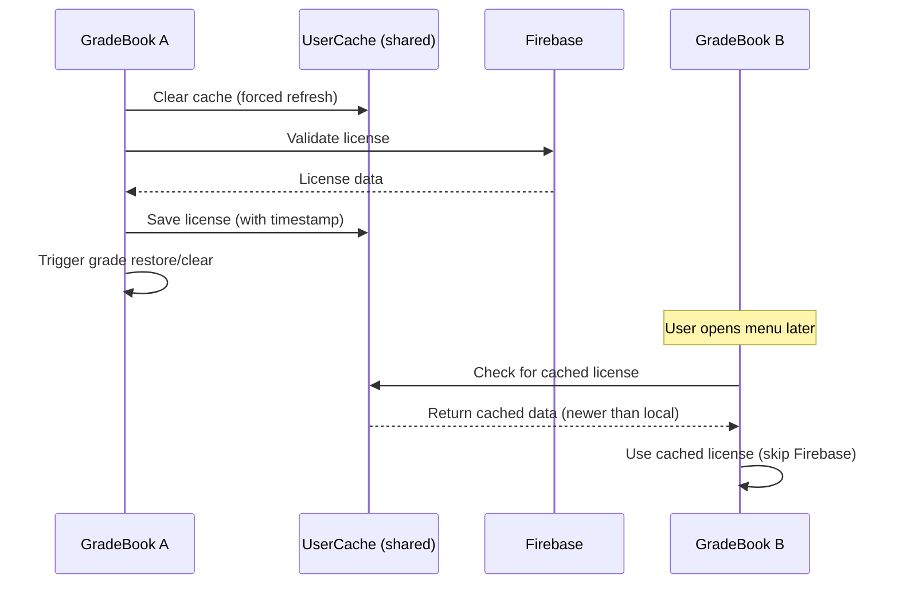

# Fix License Grade Sync

## Summary
This fix ensures that when `hasValidLicense` changes (user renews or license expires), final grades are automatically cleared or restored accordingly:
- `false → true`: Restore grades (D8:E formulas)
- `true → false`: Clear grades (D8:E content)
- `true → true`: No action (grades already restored)
- `false → false`: No action (grades already cleared)

Additionally, when the "Refresh license now" button is pressed in the Support sidebar, the global config cache is updated with fresh license information, allowing any other GradeBook instance to access it immediately.

---

## How hasValidLicense Change is Detected

### Detection Flow
1. **Previous state capture**: Before config/license refresh, current `hasValidLicense` is read from persisted state:
  - **Normal config load (`configMerged.js`)**: from `localConfig.localMeta.lastAppliedHasValidLicense` (stored in `UserProperties` with per‑GradeBook keys)
  - **Manual refresh (`supportRefreshLicenseNow`)**: uses the same local tracking via `configMerged()`
2. **Fresh license check**: Firebase is called if cache expired (`LICENSE_CHECK_INTERVAL_MS`)
3. **Comparison**: New `hasValidLicense` is compared to previous value
4. **Action trigger**: If different, `clearFinalGradesByConfig()` or `restoreFinalGradesByConfig()` is called

### Two Detection Points

#### 1. Normal Config Load (`configMerged.js`)
- Runs on every sidebar/menu open
- Tracks **Local License State** using `localConfig.localMeta.lastAppliedHasValidLicense`
- Compares Local ("Previous") vs Global ("Current")
- **Handles the state transition** (one of 4 cases):
  - `false → true`: **Action: Restore**
  - `true → false`: **Action: Clear**
  - `true → true`: No action (already valid)
  - `false → false`: No action (already invalid)
- Triggers grade sync if changed and updates local state

#### 2. Manual Refresh (`supportRefreshLicenseNow`)
- Runs when user clicks "Refresh license now" in Support sidebar
- Force-clears cache, then calls Firebase
- Invokes `configMerged()` which compares local vs global state and triggers grade sync if changed

---

## Time Constants

All intervals are defined in `_init/constants/constants.js`:

| Constant | Value | Purpose |
|----------|-------|---------|
| `LICENSE_CHECK_INTERVAL_MS` | Defined in _init/constants/constants.js | How often to validate license with Firebase |
| `LICENSE_CACHE_TTL_SECONDS` | Defined in _init/constants/constants.js | Cross-GradeBook cache TTL |
| `MARKETING_DB_CHECK_INTERVAL_MS` | Defined in _init/constants/constants.js | Marketing DB sync interval |

---

## Cross-GradeBook Cache Sync

Uses `CacheService.getUserCache()` to share license data across all GradeBooks:
- When GradeBook A refreshes → writes to UserCache
- When GradeBook B loads config → checks UserCache before Firebase
- If UserCache has fresher data → uses it (skips Firebase)
- Race condition prevention: newer timestamp always wins

### Data Flow Diagram

---

## Potential Issues (Resolved)

| Issue | Resolution |
|-------|------------|
| **Timing of triggers** | Grade sync triggers on every config load when license changes. During `LICENSE_CACHE_TTL_SECONDS` cache period, grades won't sync until cache expires — acceptable delay. |
| **Scope limitation** | `configMerged.js` only affects current gradebook. Cross-GradeBook sync addresses this via UserCache. |
| **Silent failures** | Functions log errors via `logEntry` but continue gracefully. |
| **No user feedback** | No change — intentional to avoid confusion. |
| **Dependency on config loads** | Manual refresh in Support page handles immediate needs. |
| **Grace period complications** | `LICENSE_CHECK_INTERVAL_MS` grace period for network failures; after that, fail-secure to `hasValidLicense: false`. |

---

## Files Changed
- `_init/constants/constants.js` — Grouped all cache TTL constants under unified heading with accurate comments, separated check intervals
- `config/configGlobalHelpers.js` — License validation + cross-GradeBook cache sync
- `config/utilities.js` — Updated to use constants
- `config/defaultGlobal.js` — Updated comments to reference constants
- `support/server/pageLoad.js` — Update global config cache and return Support data without redundant refresh
- `sharedFunctions/clearAndRestoreGrades.js` — Clear/restore functions; moved `restoreFinalGradesByConfig` here from `automation/offHoursOneAMFunctions.js` (plus formatting)
