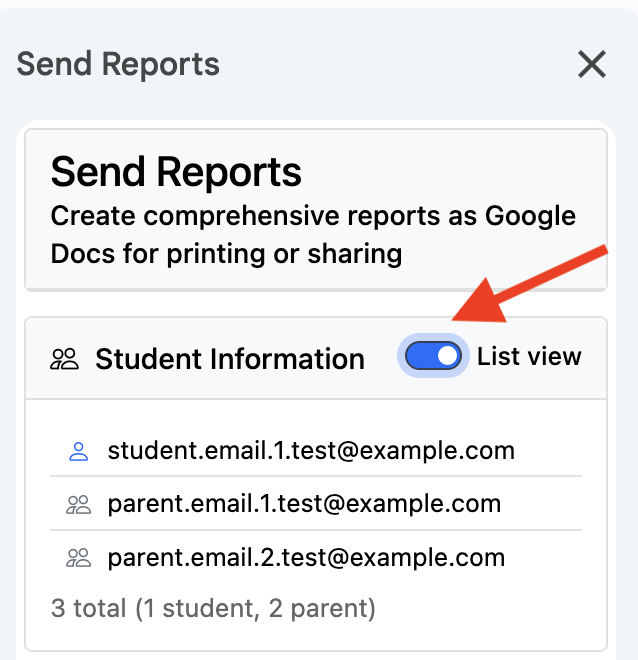

# Version History

<!-- LATEST_VERSION: 6.40 -->

GradeBook has been continuously improved since 2015. Here's what's changed.

---

## 2026

### Version 6.39 - 6.40
**Released: January 17, 2026**

- General bug fixes.

### Version 6.38
**Released: January 15, 2026**

- Fixed an issue where menus were not loading properly.

### Version 6.37
**Released: January 15, 2026**

- Improved license validation to ensure accurate subscription status display.

### Version 6.36
**Released: January 9, 2026**

- Fixed license validation.

### Version 6.35
**Released: January 6, 2026**

- Fixed an issue where custom grades with bracket notation (such as 8 [10]) were displaying incorrectly in reports.

### Version 6.30 - 6.34
**Released: January 2, 2026**

- General bug fixes and improvements.

## 2025

### Version 6.29
**Released: December 28, 2025**

- Assignments with zero weight are now excluded from student reports in category and standard-based GradeBooks, ensuring they don't appear in assignment tables or affect displayed grades.
- Fixed error message display in report generation to show specific error details instead of generic "Operation failed" messages.

### Version 6.27
**Released: December 24, 2025**

- Improved how GradeBook records auto-feature errors so failures show a clear timestamp and status.
- Improved automatic imports so more than one GradeBook can be processed within the same hour (within Google’s execution limits).

### Version 6.26
**Released: December 23, 2025**

- Improved reliability when importing attendance sheets.
- Fixed an issue where copying a gradebook could fail due to column mismatches.
- Enhanced error messages in automatic import and report features for better troubleshooting.

### Version 6.25
**Released: December 20, 2025**

- General bug fixes and stability improvements.

### Version 6.24
**Released: December 19, 2025**

- **New Feature**: List View is now available in **Extensions → GradeBook → Reports → Send Reports**.

### Version 6.23
**Released: December 18, 2025**

- Improved stability and reliability in report tools.
- Improved how messages are displayed in the app.
- Fixed an issue where settings were not always saved.

### Regarding menus not loading:
We are aware that many users are experiencing difficulties with the GradeBook menu not loading or taking multiple attempts to open. We understand how frustrating this can be and sincerely apologize for the inconvenience. This issue is affecting all Google Workspace add-ons due to recent changes by Google and is unfortunately beyond our direct control.

**Temporary Workaround:**
If the menu fails to load, please refresh your GradeBook page (**F5** on Windows, **Command + R** on Mac) and try again.

### Version 6.21-6.22
**Released: December 17, 2025**

- Improved reset process.

### Version 6.17–6.20
**Released: December 16, 2025**

- General bug fixes and performance improvements.

### Version 6.16
**Released: December 12, 2025**

- Fixed **Extensions → GradeBook → Import → Copy GradeBook**, **Extensions → GradeBook → Create New GradeBook**, and **Extensions → GradeBook → Fix Grades** to preserve assignment headings.

### Version 6.15
**Released: December 10, 2025**

- Added options to configure category priorities during imports.
### Version 6.14
**Released: December 9, 2025**

- Improved Google Classroom import to only include assignments from the selected date range, while keeping existing gradebook data intact.
- Added better checks when copying gradebooks that use categories to ensure categories are set up correctly.
- Fixed various issues to make the app more stable.

### Version 6.13
**Released: December 8, 2025**

- Resolved issue with license validation.

### Version 6.12
**Released: December 7, 2025**

- Fixed issues with unlinking Google Classroom copies
- Improved performance when sending reports
- Resolved logo display problems in reports

### Version 6.11
**Released: December 5, 2025**

- Improved overall performance and responsiveness
- Fixed bugs in Google Classroom import feature
- Enhanced reports generation performance

### Version 6.10
**Released: December 4, 2025**

- General updates and improvements.

### Version 6.09
**Released: December 4, 2025**

- Fixed an issue with importing grades from Google Classroom under **Extensions → GradeBook → Import from Classroom**

### Version 6.08
**Released: December 2, 2025**

- Improved import performance and formula preservation when using **Extensions → GradeBook → Import from Classroom**
- Enhanced **Extensions → GradeBook → Send Reports** interface with better student name display and responsive layout

### Version 6.07
**Released: December 2, 2025**

- Extended operation timeouts to better support very large GradeBooks with 200 students
- Improved error messages when reports cannot be generated due to folder access issues, with clear steps to resolve account and browser problems
- Enhanced stability and user guidance for various report generation scenarios

### Version 6.06

- **Fixed Refresh Data Button**: The **Refresh Data** button in **Generate Reports** and **Send Reports** now correctly updates the student list after refreshing
- **Enhanced Import Reliability**: Fixed issues where grade calculations and percentage formulas could be accidentally overwritten during import operations
- **Automatic Formula Repair**: GradeBook now automatically detects and restores missing grade calculation formulas when importing from Classroom
- **Improved Migration**: Legacy gradebook migration now properly preserves all calculation formulas
- **Better Error Recovery**: Enhanced error handling for network issues with improved user guidance

### Version 6.05
**Released: December 1, 2025**

- Improved error handling for better user experience when encountering network or server issues
- Fixed initialization errors that could occur on certain pages
- Streamlined error reporting to focus on actionable issues

### Version 6.04
**Released: December 1, 2025**

- Fixed a rare background error that could interrupt automatic tasks in some GradeBooks.

### Version 6.03
**Released: December 1, 2025**

- Made the **Refresh Data** button more reliable for very large GradeBooks in both **Generate Reports** and **Send Reports**.
- Fixed a refresh error that could sometimes stop the process for large classes.
- Added extra checks so long refreshes are less likely to fail and easier to diagnose if they do.

### Version 6.01–6.02
**Released: November 30, 2025**

- Fixed Google Classroom import issue where renamed assignments could appear twice (original and edited titles)
- Improved migration of legacy assignment IDs to reduce duplicate columns
- Updated support guidance for confirming the latest version and cleaning up extra assignments using Roster Manager
- Fixed a rare "Operation failed" error during Import from Classroom when preparing older GradeBooks for a fresh import (clean slate migration). Affected users just need to confirm they have the latest version under **Extensions → GradeBook → Support → Customer Support & Subscription Details** and then run Import from Classroom again.

---

### Version 6.00
**Released: November 29, 2025**

Latest stable release with documentation updates. See the [migration guide](migration.md) for details.

---

### Version 5.88
**Released: October 25, 2025**

- Improvements in Views and Sort

---

### Version 5.87
**Released: October 8, 2025**

- Minor bug fixes

---

### Version 5.81–5.86
**Released: September 30, 2025**

- Fixed import notification setting
- Minor bug fixes

---

### Version 5.80
**Released: August 21, 2025**

- Fixed clearing of auto features

---

### Version 5.79
**Released: June 2, 2025**

- Improved Copy GradeBook feature

---

### Version 5.69–5.78
**Released: May 30, 2025**

- Fixed category percentages on certain reports
- Fixed SortType issue
- Fixed JavaScript runtime issue

---

### Version 5.61–5.68
**Released: May 4, 2025**

- Added option to add a school logo to reports
- UI updates

---

### Version 5.57–5.60
**Released: March 27, 2025**

- Fixed category report error
- Added fix for invalid dates

---

### Version 5.56
**Released: March 24, 2025**

- Fixed date sorted category table

---

### Version 5.45–5.55
**Released: March 19, 2025**

- New features added

---

### Version 5.41–5.44
**Released: March 12, 2025**

- Options for displaying 0 grades
- Fixed small bug in course reports

---

### Version 5.30–5.40
**Released: March 7, 2025**

- Fixed Copy GradeBook for total points
- Preparing for new features

---

### Version 5.22–5.29
**Released: March 5, 2025**

- General update
- Updated Copy GradeBook features
- Fixed some small bugs

---

### Version 5.20–5.21
**Released: February 27, 2025**

- Fixed 0 grades issue on some reports
- Updated Support menu

---

### Version 5.15–5.19
**Released: February 25, 2025**

- Fixed course report error
- Fixed override grades for some reports
- Fixed "enter YES or NO" error

---

### Version 5.11–5.14
**Released: February 21, 2025**

- New feature: Hide category percents on reports
- Improved Fix Grades menu item

---

### Version 5.07–5.10
**Released: February 14, 2025**

- Menu fix (see [Activate Guide](https://gdev.app/activate-guide/){:target="_blank"})
- Classroom import fix

---

### Version 5.01–5.06
**Released: February 12, 2025**

- Fixed error report
- Fixed Create Course with more legacy options
- Fixed category reports
- Fixed expired license issue
- Fixed `<final>` showing on some reports

---

### Version 5.00–5.00.e
**Released: February 10, 2025**

- Lots of bug fixes
- Additional GradeBook templates to help resolve menu issue
- Error message corrupted message fix
- Fixed error log message

---

### Version 4.99.o–4.99.s
**Released: January 31, 2025**

- Improved settings menu
- Improved import from Classroom

---

### Version 4.99.h–4.99.n
**Released: January 29, 2025**

- Fixed append row errors
- Fixed source error
- Fixed import bug

---

### Version 4.99.f–4.99.g
**Released: January 26, 2025**

- GradeBook template fixes
- Menu item fixed

---

### Version 4.96–4.99.e
**Released: January 23, 2025**

- Additional logs for creating courses
- Fix for menu not loading
- Fix for attendance not showing on reports
- Fix for override grades toFixed error

---

### Version 4.93–4.95
**Released: January 19, 2025**

- Fixed merged file trashed error
- Small bug fixes

---

### Version 4.90–4.92
**Released: January 16, 2025**

- Fixed language settings not working on report generation
- Fixed English language error

---

### Version 4.86–4.89
**Released: January 14, 2025**

- Clear error messages added
- Fixed support menu for lifetime users
- Fixed menu item not loading for some users

---

### Version 4.78–4.85
**Released: January 11, 2025**

- Fixed SMS error
- Improved support menu
- Fixed menu loading issue
- Fixed missing logger function

---

### Version 4.74–4.77
**Released: January 7, 2025**

- Fixed lifetime licenses not showing correctly on support menu
- Added additional checks for menu loading issues

---

### Version 4.70–4.73
**Released: January 3, 2025**

- Happy New Year!
- Added AI [Beta] — try it out: Extensions → GradeBook → AI [Beta]

---

## 2024

### Version 4.64–4.69
**Released: December 28, 2024**

- Fixed error with 'caller', 'callee', and 'arguments'
- Fixed course report issue with Import from CSV

---

### Version 4.60–4.63
**Released: December 28, 2024**

- Premium features added

---

### Version 4.58–4.60
**Released: December 27, 2024**

- Added Import from CSV
- Increased report runtime
- Fixed import from Classroom bug

---

### Version 4.55–4.57
**Released: December 20, 2024**

- Added additional debugging functionality for automatic imports
- Improved error handling for automatic features

---

### Version 4.52–4.54
**Released: December 19, 2024**

- Added better timezone handling for automatic features

---

### Version 4.51
**Released: December 17, 2024**

- Fixed a bug in the Fix Grades menu item

---

### Version 4.45–4.50
**Released: December 15, 2024**

- Refactored automatic imports for better reliability
- Added BCC option when sending reports
- Fixed trigger error in settings

---

### Version 4.42–4.44
**Released: December 12, 2024**

- Fixed some small bugs

---

### Version 4.38–4.41
**Released: December 9, 2024**

- Added email confirmation for automatic features
- Fixed Classroom photos having incorrect URLs
- Fixed appendTable error

---

### Version 4.32–4.37
**Released: December 7, 2024**

- Fixed bug with errorName being undefined
- Fixed bug with automatic imports
- Fixed bug with support menu not showing on non-GradeBooks

---

### Version 4.30–4.31
**Released: December 4, 2024**

- Added menu item: Extensions → GradeBook → Support → Send Obfuscated GradeBook
- Allows sending an obfuscated copy of a user's GradeBook to ensure security and privacy with student data

---

### Version 4.26–4.29
**Released: December 2, 2024**

- Fixed more unique bugs reported by users

---

### Version 4.25
**Released: November 29, 2024**

- Fixed content not loading error on some accounts

---

### Version 4.24
**Released: November 28, 2024**

- Fixed small bug in settings menu

---

### Version 4.22–4.23
**Released: November 27, 2024**

- Fixed reportType error in generating reports
- Added more error information to help identify issues

---

### Version 4.18–4.21
**Released: November 26, 2024**

- Added more error information to help debug issues
- Fixed support menu

---

### Version 4.16–4.17
**Released: November 24, 2024**

- Added additional error information to help debug issues
- Fixed issue when sheets were deleted to add sheets back

---

### Version 4.15
**Released: November 22, 2024**

- Minor bug fixes with reports

---

### Version 4.13–4.14
**Released: November 21, 2024**

- Fixed attendance option not showing on reports
- Fixed attendance menu item not loading courses
- Minor bug fixes related to menu items

---

### Version 4.10–4.12
**Released: November 21, 2024**

- Fixed import settings not being applied correctly
- Minor bug fixes

---

### Version 4.09
**Released: November 19, 2024**

- Fixed Category Course Reports (categories not showing)

---

### Version 4.07–4.08
**Released: November 19, 2024**

- Fixed import from Classroom
- Added menu item to fix grades if grades are not displaying correctly
- Fixed reports not working with some yes/no selections

---

### Version 4.01–4.06
**Released: November 18, 2024**

- Fixed some new version bugs with menu items

---

### Version 4.00
**Released: November 17, 2024**

- **Major update**
- Automatic features update

---

### Version 3.01
**Released: October 13, 2024**

- Optimized the license check function for faster performance
- Cleanup of outdated functions

---

### Version 2.95–2.99
**Released: August 12, 2024**

- Fixed incorrect Classroom photo links

---

### Version 2.93–2.94
**Released: February 18, 2024**

- Fixed broken image links
- Updated UI

---

## 2023

### Version 2.92
**Released: December 1, 2023**

- Small fix for SMS function

---

### Version 2.91
**Released: November 5, 2023**

- Fixed minor Classroom import bug

---

### Version 2.90
**Released: March 14, 2023**

- Added error message for exceeded sent emails

---

### Version 2.89
**Released: February 2, 2023**

- Improved responsiveness and import times

---

## 2022

### Version 2.87–2.88
**Released: September 14, 2022**

- Small bug fixes
- Updated UI

---

## 2021

### Version 2.86
**Released: December 13, 2021**

- Added sorting options for category-type GradeBooks

---

### Version 2.85
**Released: May 20, 2021**

- Fixed email reports bug

---

### Version 2.84
**Released: April 21, 2021**

- Added attendance sheets when copying GradeBook

---

### Version 2.83
**Released: April 17, 2021**

- Small bug fix with terms GradeBook

---

### Version 2.82
**Released: April 13, 2021**

- Added ability to increase GradeBook size

---

### Version 2.81
**Released: April 13, 2021**

- Fixed trial account error

---

### Version 2.77–2.80
**Released: March 25, 2021**

- Fixed clear triggers refresh issue

---

### Version 2.76
**Released: March 17, 2021**

- Fixed report formatting when showing letter and percent grades

---

### Version 2.70–2.75
**Released: March 16, 2021**

- Tested automatic imports bug

---

### Version 2.69
**Released: March 8, 2021**

- Custom domain report added

---

### Version 2.68
**Released: February 23, 2021**

- Added checkbox to copy classes UI

---

### Version 2.67
**Released: February 21, 2021**

- Small UI changes

---

### Version 2.65–2.66
**Released: February 16, 2021**

- Small bug fixes

---

### Version 2.64
**Released: February 11, 2021**

- Beta testing for new settings menu item

---

### Version 2.56–2.63
**Released: February 9, 2021**

- Beta testing for automatic reports

---

### Version 2.52–2.55
**Released: January 23, 2021**

- Added new languages for reports
- Added letter grades to reports
- Fixed Safari images bug

---

## 2020

### Version 2.51
**Released: November 9, 2020**

- Fixed broken image links

---

### Version 2.50
**Released: November 5, 2020**

- Fixed regex bug with category import

---

### Version 2.49
**Released: November 2, 2020**

- Fixed timezone issue

---

### Version 2.48
**Released: October 26, 2020**

- Fixed undefined user last name on Classroom import

---

### Version 2.47
**Released: October 21, 2020**

- Minor bug fixes

---

### Version 2.46
**Released: October 16, 2020**

- New report feature: overall grade only

---

### Version 2.45
**Released: October 11, 2020**

- General update

---

### Version 2.43–2.44
**Released: September 22, 2020**

- Activation server bug fix

---

### Version 2.41–2.42
**Released: September 20, 2020**

- Fix for automatic import bug with topics

---

### Version 2.40
**Released: September 16, 2020**

- Fixed specific domain configuration

---

### Version 2.39
**Released: August 29, 2020**

- Fixed minor import bug

---

### Version 2.38
**Released: July 20, 2020**

- Speed improvements

---

### Version 2.36–2.37
**Released: June 25, 2020**

- Minor bug fixes

---

### Version 2.35
**Released: June 15, 2020**

- Support for import by topics

---

### Version 2.34
**Released: June 5, 2020**

- Minor bug fixes

---

### Version 2.31–2.33
**Released: June 1, 2020**

- Fixed automatic import bug
- Minor bug fixes

---

### Version 2.29–2.30
**Released: May 29, 2020**

- Added ability to import Guardians
- Fixed some visual designs

---

### Version 2.27–2.28
**Released: May 18, 2020**

- Exempt assignments not assigned to students in Google Classroom

---

### Version 2.25–2.26
**Released: May 13, 2020**

- Initial setup to improve performance

---

### Version 2.22–2.24
**Released: May 6, 2020**

- Added Canadian text messaging

---

### Version 2.17–2.21
**Released: May 3, 2020**

- Fixed automatic import bug

---

### Version 2.14–2.16
**Released: April 30, 2020**

- Fixed import bug with number of assignments

---

### Version 2.12–2.13
**Released: April 29, 2020**

- Fixed import bug

---

### Version 2.09–2.11
**Released: April 28, 2020**

- Added text messaging option

---

### Version 2.02–2.08
**Released: April 20, 2020**

- Added automatic import feature

---

### Version 2.00–2.01
**Released: April 14, 2020**

- Added additional checks for persistent Google server errors

---

### Version 1.97–1.99
**Released: April 13, 2020**

- Added links to user guide in settings sidebar

---

### Version 1.96
**Released: April 7, 2020**

- Added new email fields: comments and student number

---

### Version 1.95
**Released: April 3, 2020**

- Added custom features for select users

---

### Version 1.93–1.94
**Released: March 30, 2020**

- Fixed authorization bug

---

### Version 1.91–1.92
**Released: March 9, 2020**

- Fixed Classroom import bug

---

### Version 1.90
**Released: February 2, 2020**

- Import by topics feature for new GradeBooks

---

## 2019

### Version 1.88–1.89
**Released: September 30, 2019**

- Fixed Chrome issues with external links

---

### Version 1.87
**Released: September 25, 2019**

- Fixed attendance issue

---

### Version 1.86
**Released: September 18, 2019**

- Sorting fixes

---

### Version 1.85
**Released: September 3, 2019**

- Fixed Classroom import bug

---

### Version 1.84
**Released: August 29, 2019**

- Fixed rare bug with more than 150 assignments

---

### Version 1.83
**Released: August 28, 2019**

- Added ability to clear notes on copied classes

---

### Version 1.82
**Released: May 15, 2019**

- Allowed import from Classroom without assignments

---

### Version 1.77–1.81
**Released: May 8, 2019**

- Maintenance update
- Automatic import from Classroom

---

### Version 1.76
**Released: April 15, 2019**

- Fixed category reports with exempt grades

---

### Version 1.75
**Released: April 8, 2019**

- Fixed sorting bug

---

### Version 1.73–1.74
**Released: March 29, 2019**

- Maintenance update

---

### Version 1.72
**Released: March 22, 2019**

- Option for non-numeric values for override grades

---

### Version 1.71
**Released: March 8, 2019**

- Fixed Google Classroom import with empty grades

---

### Version 1.70
**Released: January 8, 2019**

- Fixed Google Classroom Photos issue

---

### Version 1.69
**Released: January 3, 2019**

- Prevented exempt grades override on Google import

---

## 2018

### Version 1.68
**Released: December 18, 2018**

- Detected incorrect categories/weights in Classroom imports

---

### Version 1.67
**Released: November 26, 2018**

- Added error messages

---

### Version 1.66
**Released: November 22, 2018**

- Attendance sheet checks added

---

### Version 1.65
**Released: November 13, 2018**

- Additional support menu information

---

### Version 1.64
**Released: November 7, 2018**

- Fixed letter grade issue

---

### Version 1.63
**Released: November 6, 2018**

- Fixed override grades
- Updated letter grades

---

### Version 1.62
**Released: October 20, 2018**

- Added new support links

---

### Version 1.61
**Released: October 3, 2018**

- Added letter grades feature (requires new GradeBook)

---

### Version 1.60
**Released: September 19, 2018**

- Added a message when importing from Classroom with no students or assignments

---

### Version 1.57–1.59
**Released: September 4, 2018**

- Improved import by due date using Google Classroom
- Improved handling of ungraded entries
- Fixed date offset issue by one month

---

### Version 1.55–1.56
**Released: August 10, 2018**

- Fixed incorrect URLs in settings

---

### Version 1.54
**Released: July 27, 2018**

- Fixed issue with email reports not being correctly logged

---

### Version 1.53
**Released: July 12, 2018**

- Added ability to choose attendance range in reports

---

### Version 1.52
**Released: June 18, 2018**

- Added attendance to reports

---

### Version 1.51
**Released: June 2, 2018**

- Introduced attendance feature

---

### Version 1.49
**Released: May 15, 2018**

- Fixed bug with "send as no-reply" email option

---

### Version 1.48
**Released: May 1, 2018**

- Minor code cleanup

---

### Version 1.46–1.47
**Released: April 18, 2018**

- Fixed minor issue with notes feature

---

### Version 1.44–1.45
**Released: April 5, 2018**

- Fixed rare Classroom import bug
- Added terms [beta] template for GradeBook

---

### Version 1.42–1.43
**Released: March 22, 2018**

- Fixed "import as zero" grades issue
- Fixed weight erasure on import

---

### Version 1.41
**Released: February 28, 2018**

- Added new feature: bulk import adjustments

---

### Version 1.39–1.40
**Released: January 12, 2018**

- Updated menu items and general code improvements

---

## 2017

### Version 1.38
**Released: December 20, 2017**

- Increased max assignments to 150
- Added new settings menu item

---

### Version 1.37
**Released: November 7, 2017**

- Added total points option to reports
- Improved notes import

---

### Version 1.36
**Released: October 3, 2017**

- Fixed issue with notes being shifted upon sorting

---

### Version 1.35
**Released: August 21, 2017**

- Added categories to course report

---

### Version 1.34
**Released: July 14, 2017**

- Fixed sorting from Google Classroom import

---

### Version 1.33
**Released: June 9, 2017**

- Minor bug fixes

---

### Version 1.31–1.32
**Released: April 26, 2017**

- Added new features:
  - Total points template
  - Google Classroom import for all templates
  - Class copying for new term/semester

---

### Version 1.29–1.30
**Released: March 14, 2017**

- Code cleanup

---

### Version 1.27–1.28
**Released: February 2, 2017**

- Added new features:
  - Import from Google Classroom using specific dates
  - Simple (condensed) reports

---

### Version 1.26
**Released: January 12, 2017**

- Updated support links

---

## 2016

### Version 1.23–1.25
**Released: November 28, 2016**

- Added two new features:
  - Choose between zero or no mark for Classroom import
  - Simple reports (requires new GradeBook)

---

### Version 1.22
**Released: October 14, 2016**

- Fixed Classroom import error

---

### Version 1.20–1.21
**Released: September 2, 2016**

- Added Classroom import error codes

---

### Version 1.19
**Released: August 2016**

- Added column for photo/student number in Classroom template
- Fixed editor permission error

---

### Version 1.17–1.18
**Released: July 2016**

- Added detailed error messages for better issue identification

---

### Version 1.16
**Released: June 2016**

- Fixed empty grades being overwritten with zero on import

---

### Version 1.15
**Released: May 2016**

- Fixed category averages for reports with modified grades

---

### Version 1.14
**Released: April 2016**

- Fixed date format on some GradeBooks
- Added message for outdated GradeBook templates

---

### Version 1.12–1.13
**Released: March 2016**

- Fixed incorrect date formatting
- Added alerts for older GradeBooks
- Enhanced loading screens with more feedback

---

### Version 1.04–1.11
**Released: February 2016**

- Fixed parent emails being erased after Classroom import
- Fixed missing menu items

---

### Version 1.03
**Released: January 2016**

- Added sorting of assignments by Name or Date under Add-ons → GradeBook → Sort

---

## 2015

### Version 1.02
**Released: December 2015**

- Fixed sorting for initial Google Classroom import by assignment name

---

### Version 1.01
**Released: December 2015**

- Fixed student name errors
- Corrected "no mark" display when zero entered in GradeBook
- Adjusted report column sorting for standard reports
- Fixed subject line in emailed reports

---

### Version 1.00
**Released: November 2015**

- **Initial release** 🎉

---

{: .note }
> GradeBook has been helping educators manage grades since 2015. [Install GradeBook](https://workspace.google.com/marketplace/app/gradebook/292160741496){:target="_blank"} to get started!
